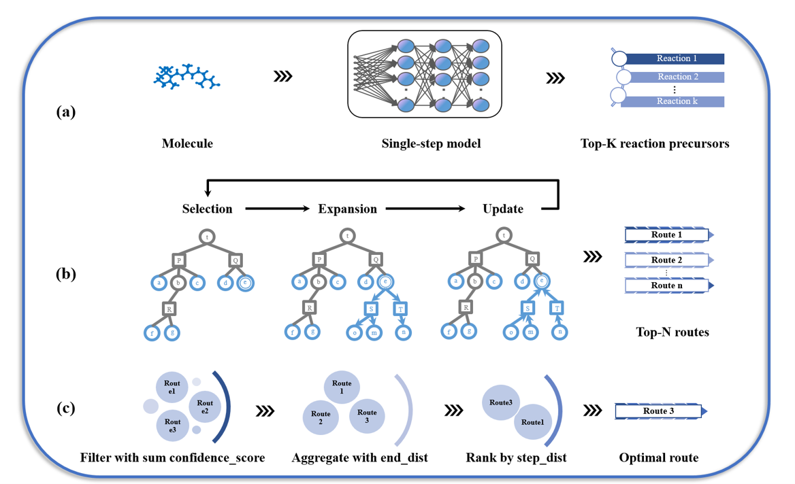
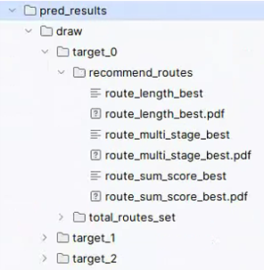

# RetroScore: graph edit distance-guided retrosynthesis for accessibility scoring with route metrics

Molecule generation is a critical method in drug design, but its practical application is often limited due to the difficulty in synthesizing the generated molecules. To solve this problem, we present RetroScore, a comprehensive synthetic accessibility evaluation framework guided by multistep retrosynthesis planning. For molecule generation task, RetroScore outperformed six of seven synthetic accessibility metrics, yielding molecules with enhanced synthetic accessibility profiles across heterogeneous evaluation frameworks. 


## Pip install and API use
 1. Download and install the package (need python >= 3.11).
```
pip install retroscore
```
 2. API for RetroScore
 ```
from RetroScore import RetroScore
from rdkit import Chem

rs = RetroScore()
smi = "NCCC1=CC=CC(C2=NC(NC3=CC=CC=C3)=C4C(NC=N4)=N2)=C1"
mol = Chem.MolFromSmiles(smi)
score = rs.calculate_score(mol)
print(score)
6.852954353761519
```

## Environment Requirements  
Create a virtual environment to run the code of RetroScore.
Install pytorch with the cuda version that fits your device.
```
conda create -n RetroScore python=3.11 \
conda activate RetroScore \
pip install torch==2.6.0 torchvision==0.21.0 torchaudio==2.6.0 --index-url https://download.pytorch.org/whl/cu118 \
pip install -r requirements.txt
```
## data
Click here: [[retro_data.zip (dropbox.com)](https://www.dropbox.com/scl/fi/cchn0wjz8j0dqxhr0qrom/retro_data.zip?rlkey=kqz60ec7vx7087vg1o63nucyo&e=1&dl=0)] to download and unzip files. Please put all the folders (`dataset/` and `saved_models/`) under the `data/multi_step/retro_data` directory.

## One-step retrosynthesis model
One-step retrosynthesis model has been trained according to Graph2edits, if you want to train your own model, please refer to Graph2edits: [enter link description here](https://github.com/Jamson-Zhong/Graph2Edits). We provide two trained checkpoint to use, which is placed in folder "experiments".

1) A one-step model trained on uspto 50k is:  experiments/uspto_50k/epoch_123.pt   
2) A one-step model trained on uspto full is:  experiments/uspto_full/epoch_65.pt


## One-step retrosynthesis prediction
Go to the script folder and run the following to predict one-step precursors for target compounds (default use epoch_65.pt)

1) prediction for one compound
```
python single_step_predict.py --smi "CON(C)C(=O)CC1COCCN1C(=O)OC(C)(C)C"
```
2) prediction for batch compounds
```
python single_step_predict.py --fpath **FILE_PATH**
```
**FILE_PATH** is your csv file with target molecule smiles strings as one column and the header named **SMILES**, the prediction results will be saved at *pred_results/precursor_pred.csv*


## Multistep retrosynthesis planning

Go to the script folder and run the following to plan multistep routes for compounds (default use epoch_65.pt)

1) planning for one compound
```
python run_multistep_pre.py --smi "CON(C)C(=O)CC1COCCN1C(=O)OC(C)(C)C"
```
2) planning for batch compounds
```
python run_multistep_pre.py --dataset **FILE_PATH**
```
**FILE_PATH** is your csv file with target molecule smiles strings as one column and the header named **SMILES**, the planning results will be saved at *pred_results*/
*routes_pred.csv*:  Recommended synthesis routes, as length optimal; sum confidence score optimal and multi-stage optimal.
*routes_pred_all_routes.pkl*:  Full synthesis routes set.
*routes_pred.pkl*:  Original planning results, can be used for further processing.

### visualization of multistep retrosynthesis routes
If you want to visualize the multistep reaction route, we provide a script here:
```
python draw_rxn_routes.py --fpath **FILE_PATH**
```
**FILE_PATH** is the file concluding routes need to be visualized, supporting *routes_pred.csv* and *routes_pred_all_routes.pkl* from multistep planning. The images will be saved at *pred_results/draw/*



## Calculate RetroScore for compounds
To calculate RetroScore for compounds, please prepare a csv file with target molecule smiles strings as one column and the header named **SMILES**. First, run multistep retrosynthesis planning, then calculate RetroScore based on the planning results. You can run the following steps.

1) cd script
2) run multistep retrosynthesis planning
```
python run_multistep_pre.py --dataset **FILE_PATH**
```
3) calculate RetroScore based on the planning results
```
python compute_retro_score.py
```
**FILE_PATH** is your csv file with target molecule smiles strings as one column and the header named **SMILES**, the results will be saved at *pred_results/pred_RetroScore.csv*

